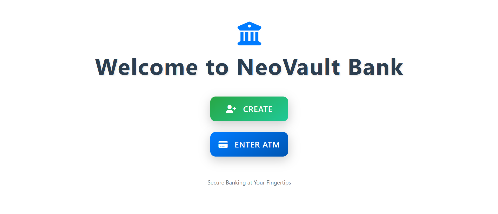
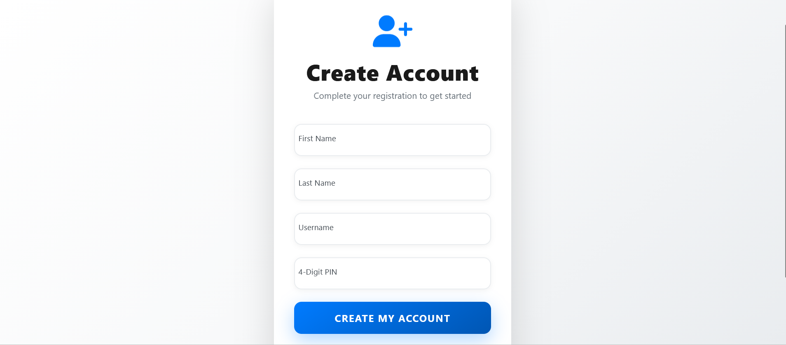
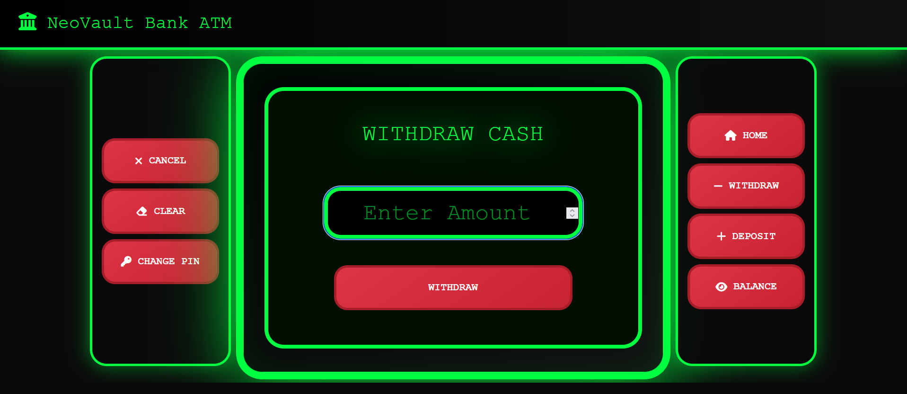
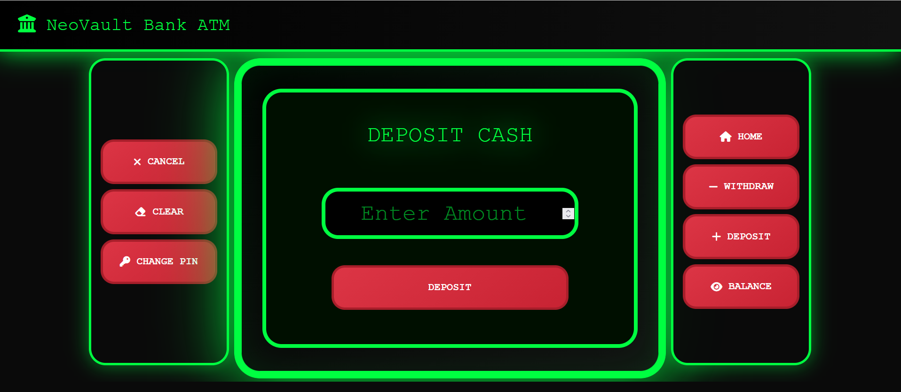
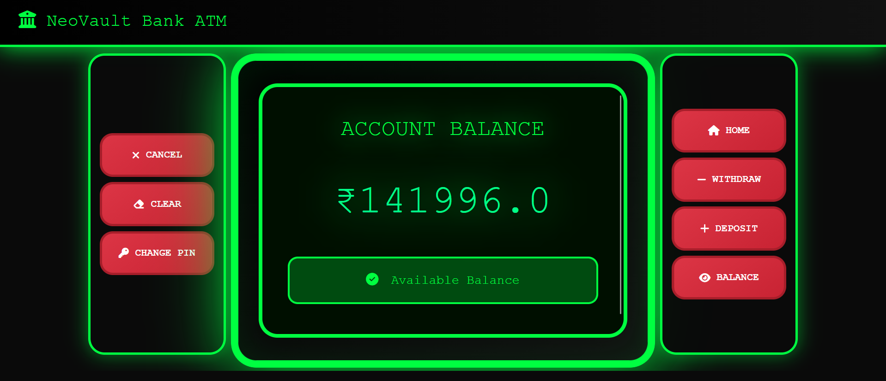
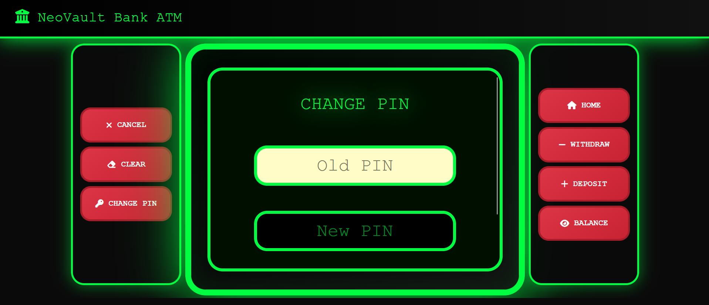

# NeoVault Bank ATM Simulator

A modern web-based ATM Simulator application built using Java, JSP, Servlet, and MySQL.This project simulates basic ATM banking operations such as account creation, secure PIN login, deposit, withdrawal, balance enquiry, and PIN change through an ATM-style user interface.

---

## Features

- Create New Account
- Secure 4-Digit PIN Login
- ATM Dashboard
- Balance Enquiry
- Deposit Cash
- Withdraw Cash
- Change PIN
- Session Management
- Transaction Acknowledgement Messages
- MySQL Database Connectivity
- Responsive ATM User Interface

---

## Project Highlights

- Developed using Java, JSP, Servlets, JDBC and MySQL
- Session-based user authentication
- ATM-style responsive user interface
- Real-time balance updates
- Deposit and withdrawal transaction processing
- Secure PIN change functionality
- MySQL database integration

---

## Tech Stack

- Java
- JSP
- Servlet
- HTML
- CSS
- Bootstrap
- Javascript
- MySQL
- Apache Tomcat
- Eclipse IDE


---

## Project Screenshots

### Home Page


### Create Account


### PIN Login


### ATM Dashboard


### Withdraw Operation


### Deposit Operation


### Balance Enquiry


### Change PIN


---

## Database

The project uses MySQL database.

Database file included:

```text
atm.sql
```

Import `atm.sql` into MySQL Workbench before running the project.

---

## How to Run the Project

1. Download or clone this repository.
2. Open Eclipse IDE.
3. Import the project into Eclipse.
4. Configure Apache Tomcat server.
5. Import `atm.sql` into MySQL Workbench.
6. Update database username and password in the database connection file if required.
7. Run the project on Tomcat server.
8. Open browser and visit:

```text
http://localhost:8080/atmsimulator/
```

---

## Project Structure

```text
NeoVault-Bank-ATM/
│
├── src/
├── screenshots/
│   ├── home-page.png
│   ├── create-account.png
│   ├── pin-login.png
│   ├── atm-dashboard.png
│   ├── withdraw-operation.png
│   ├── deposit-operation.png
│   ├── balance-enquiry.png
│   └── change-pin.png
│
├── atm.sql
├── README.md
└── .gitignore
```

---

## Future Improvements

- Transaction History / Mini Statement
- Fund Transfer Between Accounts
- Admin Dashboard
- Receipt Generation
- Account Locking After Multiple Failed PIN Attempts
- Enhanced Validation
- Mobile Responsive Layout
- Email/SMS Notifications

---

## Author

Adithya Jilakara

Aspiring Java Full Stack Developer

Skills:
- Java
- JSP & Servlets
- JDBC
- JavaScript
- MySQL
- HTML
- CSS
- Bootstrap
- Git & GitHub